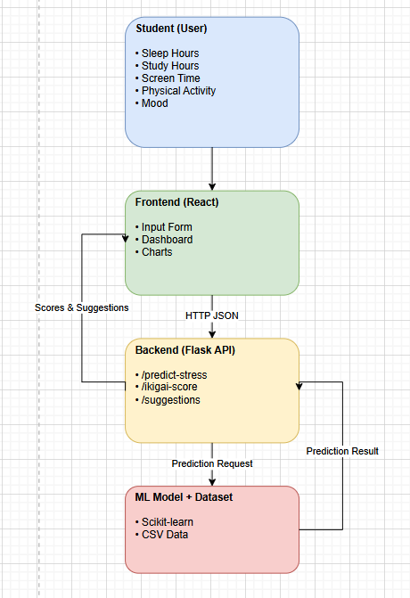

**Ikigai-Based Mental Health & Productivity Correlator for Students**

*Problem:*
Students’ mental health issues often go unnoticed until they reach critical stages such as burnout, anxiety, or academic failure. Existing solutions are either reactive, medicalized, or disconnected from students’ daily routines and productivity patterns.

*Solution:*
This project proposes a web-based system that uses data science and machine learning to analyze students’ daily habits—including sleep patterns, study hours, screen time, physical activity, and self-reported mood—to predict stress levels and productivity.

*🎯 Objectives*
1.. Identify early stress and burnout patterns in students
2.. Encourage balanced routines using behavioral data
3.. Translate the Ikigai philosophy into measurable indicators
4.. Provide explainable, ethical, and preventive insights

By integrating the Ikigai framework (What you love, What you are good at, What the world needs, and What you can be paid for), the system visualizes balance between mental well-being and academic effort. The platform provides early stress indicators and personalized suggestions to help students maintain a healthy, sustainable routine before serious mental health issues occur.
Disclaimer: 
This system is not a medical diagnostic tool. It is intended for awareness, self-reflection, and preventive well-being support.

🛠️ *Technology Stack*
Frontend: React, Tailwind CSS
Backend: Flask (Python)
Machine Learning: Pandas, Scikit-learn
Data: Synthetic CSV dataset
Visualization: Chart.js / Recharts

🚀 *Future Scope*
Real-time habit tracking
Personalized long-term recommendations
Integration with wearable health data
College-wide anonymous stress analytics

👤 *Target Users*
College and university students (18–25 years)
Students facing academic pressure and screen overuse

*flowchart:*

Student → Web Frontend → Flask Backend → ML Model → Dashboard
“The student enters daily habit data through the React frontend.
The frontend sends this data as JSON to a Flask backend, which calls a machine learning model trained on CSV data to predict stress levels.
The backend also computes productivity and Ikigai scores and returns insights and suggestions back to the frontend, where they are visualized on a dashboard.”

*explain:*
1..Ikigai is traditionally philosophical.
In our project, we operationalize Ikigai using behavioral data to make it measurable and actionable for students.
2..Mental health is complex and subjective.
Our system does not diagnose conditions.
It identifies early behavioral patterns associated with stress and imbalance, enabling preventive awareness and healthier routines.

*forulas:*
This project uses a three-layer scoring system to analyze students’ daily behavioral data in a safe and explainable manner.
The system is not a medical diagnostic tool and is intended only for awareness and preventive well-being insights.

🧮 Scoring Methodology (Explainable & Ethical)
This project uses a three-layer scoring system to ensure safety, transparency, and interpretability.

**🔹 Layer 1: Normalization (0–100 Scale)**
Raw user inputs are converted into normalized scores so that different units (hours, minutes, ratings) can be compared fairly.

🛌 Sleep Score
If 7–8 hours → 100
If 6–7 or 8–9 hours → 80
If 5–6 or 9–10 hours → 60
Else → 30

📚 Study Score
If 4–6 hours → 90
If 2–4 or 6–8 hours → 75
If <2 or >8 hours → 50

📱 Screen Time Score (Inverted)
If ≤2 hours → 90
If 2–4 hours → 75
If 4–6 hours → 50
If >6 hours → 30

🏃 Physical Activity Score
If ≥30 minutes → 90
If 15–30 minutes → 70
If <15 minutes → 40

😌 Mood Score
MoodScore = (Mood / 5) × 100

**🔹 Layer 2: Weighted Scoring**
Different behavioral factors affect mental health differently. Weighted scoring is used based on common psychological patterns.

🧠 Stress Risk Score
StressScore =
0.30 × SleepScore +
0.25 × MoodScore +
0.20 × ScreenScore +
0.15 × StudyScore +
0.10 × ActivityScore

Stress Level Classification
Stress Score	Level
≥75	            Low
50–74	        Medium
<50	            High

📊 Productivity Score
ProductivityScore =
0.40 × StudyScore +
0.30 × SleepScore +
0.20 × ActivityScore +
0.10 × ScreenScore

🌸 Ikigai-Based Balance Calculation
The Ikigai framework is operationalized using measurable behavioral indicators.

Ikigai Pillar Scores
Love    = (MoodScore + ActivityScore) / 2
GoodAt  = StudyScore
Need    = (SleepScore + (100 − StressScore)) / 2
Value   = ProductivityScore

🌟 Final Ikigai Balance Score
IkigaiScore = (Love + GoodAt + Need + Value) / 4

**🔹 Layer 3: Machine Learning with Safety Overrides**
A machine learning model (Logistic Regression / Decision Tree) is used only as a supporting tool to identify stress risk patterns.

Safety Rules
If sleep < 4 hours OR mood ≤ 2 → Stress ≥ Medium
If sleep < 3 hours AND screen time > 6 hours → Stress = High

These rules ensure the system never underestimates potential risk

🏁 *Conclusion*

The Ikigai-Based Mental Health & Productivity Correlator for Students presents a preventive and ethically responsible approach to student well-being by integrating behavioral data analysis with the Ikigai framework. Instead of attempting medical diagnosis, the system focuses on identifying early risk patterns associated with stress, imbalance, and burnout in students’ daily routines.

By transforming routine behavioral inputs—such as sleep patterns, study hours, screen time, physical activity, and self-reported mood—into explainable scores, the platform provides students with meaningful insights into their mental and productivity balance. The layered scoring methodology ensures transparency, while the combination of rule-based logic and machine learning enables both adaptability and safety.

Most importantly, the inclusion of the Ikigai framework encourages students to view productivity and mental health not as opposing forces, but as interconnected dimensions of a balanced life. This approach promotes self-awareness, sustainable habits, and long-term well-being rather than short-term performance optimization.

Overall, this project demonstrates how responsible data science and human-centered design can be applied to mental health–adjacent problems, offering a scalable foundation for future educational and wellness platforms aimed at proactive student support.

**EXPLAINATION**

🟢 Opening (20–30 seconds)

Hello everyone.
Today I’m presenting our project called Ikigai-Based Mental Health & Productivity Correlator for Students.

The core problem we address is that students’ mental health issues often remain unnoticed until they turn into burnout or serious stress, especially during exams. Most existing solutions are reactive or medical in nature, whereas students need an early, preventive awareness system.

🟢 What the System Does (30 seconds)

Our system is a web-based application that analyzes students’ daily habits such as sleep hours, study time, screen usage, physical activity, and mood.

Using data science and machine learning, it predicts stress risk, calculates productivity, and visualizes Ikigai balance, which represents harmony between well-being and effort.

🟢 Live Input Explanation (30 seconds)

Here on the screen, a student enters their daily routine data — for example, how many hours they slept, studied, how much screen time they had, whether they exercised, and their current mood.

These inputs are intentionally simple so that students can use the system daily without effort.

🟢 Behind-the-Scenes Logic (40–45 seconds)

Internally, the system works in three layers.

First, raw inputs are normalized into a 0–100 scale using explainable, research-informed ranges — for example, optimal sleep scores higher than very low or excessive sleep.

Second, we apply weighted scoring, where factors like sleep and mood have more influence than screen time. This produces a stress risk score and a productivity score.

Third, a machine learning model supports the system by identifying stress patterns, but the final output always passes through rule-based safety checks to avoid underestimating risk.

🟢 Ikigai Integration (30–40 seconds)

What makes our solution unique is the integration of the Ikigai framework.

We translate Ikigai’s four pillars — what you love, what you are good at, what the world needs, and what you can be paid for — into measurable behavioral indicators.

This allows students to see not just how stressed they are, but why their routine may be imbalanced.

🟢 Output & Insights (30 seconds)

Based on the analysis, the dashboard displays the student’s stress risk level, productivity score, and overall Ikigai balance.

The system also provides personalized suggestions, such as improving sleep consistency, reducing screen time, or adding physical activity, to help restore balance.

🟢 Ethical Note (IMPORTANT – 15 seconds)

It’s important to note that this system does not diagnose mental health conditions.

It is designed purely for awareness, self-reflection, and early prevention, and does not replace professional medical advice.

🟢 Closing (15–20 seconds)

In conclusion, this project demonstrates how responsible data science and human-centered design can be used to support student well-being proactively.

The solution is scalable, ethical, and can be extended for colleges, learning platforms, or wellness programs in the future.

Thank you.

**🎯 1-Minute Judging Pitch**

“Hello judges.
Our project is called Ikigai-Based Mental Health & Productivity Correlator for Students.

The problem we address is that students’ mental health issues often go unnoticed until they turn into burnout or academic failure. Existing solutions are mostly reactive or medical, whereas students need early, preventive awareness integrated into their daily routines.

Our solution is a web-based system that analyzes simple daily habit data such as sleep, study hours, screen time, physical activity, and mood. Using data science and a supporting machine learning model, we predict stress risk, calculate productivity, and visualize Ikigai balance.

What makes our approach unique is the use of the Ikigai framework, where we translate its four pillars into measurable behavioral indicators, helping students understand not just how stressed they are, but why their routine is imbalanced.

Importantly, this system does not diagnose mental health conditions. It is designed ethically for awareness and early prevention, with explainable scoring and safety checks.

Overall, our project demonstrates how responsible data science can proactively support student well-being in a scalable and human-centered way.

Thank you.”

**🧑‍⚖️ Judge Q&A – Strong, Safe, Confident Answers**

❓ Q1. How accurate is your model?
“Mental health is complex and subjective, so we do not claim diagnostic accuracy.
Our system focuses on risk indication, not diagnosis.
The model provides consistent and explainable outputs, which are combined with rule-based safety checks to avoid underestimating stress.”
💡 Shows honesty, ethics, and maturity.

❓ Q2. Is this a mental health diagnostic tool?
“No. This system does not diagnose mental health conditions.
It is designed for awareness, self-reflection, and early prevention.
We clearly state this disclaimer and avoid medical claims.”
💡 Judges LOVE clear boundaries.

❓ Q3. Why did you use Ikigai? Isn’t it philosophical?
“Ikigai is traditionally philosophical, but we operationalized it using measurable behavioral indicators.
This allows us to translate abstract well-being concepts into actionable, data-driven insights for students.”
🔥 This shows innovation + thinking.

❓ Q4. Why not use a deep learning model?
“For mental health–adjacent applications, explainability and safety are more important than complexity.
Simple, interpretable models combined with rule-based logic are more responsible and suitable for early-risk systems.”
🎯 Mature engineering thinking.

❓ Q5. How did you decide the scoring weights?
“Weights were chosen conservatively based on common psychological findings where sleep and mood have stronger influence on stress than screen time or activity.
The system is designed to be tunable and adjustable with real-world feedback.”
💡 Shows flexibility and grounding.

❓ Q6. What if the user enters incorrect or fake data?
“Since inputs are self-reported, we treat results as approximate indicators rather than facts.
The system focuses on patterns over time rather than single-day predictions, reducing the impact of occasional incorrect inputs.”

❓ Q7. Can this replace a counselor or psychologist?
❌ Never say yes.
“No. This system is not a replacement for professional care.
It can only act as an early awareness tool that may encourage students to seek help when needed.”

❓ Q8. What makes your project different from existing wellness apps?
“Most apps either track isolated metrics or react after stress occurs.
Our solution combines behavioral data, Ikigai-based balance analysis, and explainable scoring to focus on why imbalance happens and how to restore it.”

❓ Q9. Is this scalable?
“Yes. The architecture is lightweight and modular.
It can scale from individual students to institutional dashboards, while preserving user privacy.”

❓ Q10. How will you improve this in the future?
“Future improvements include real-time habit tracking, wearable integration, personalized long-term insights, and anonymized institutional analytics to identify academic stress trends.”

❓ Q11. What ethical concerns did you consider?
“We avoided medical claims, ensured explainable logic, added safety overrides, and included clear disclaimers.
Ethical responsibility was prioritized over claiming high accuracy.”
🔥 This is a top-tier answer.

❓ Q12. If the ML model and rules disagree, which one wins?
“Rule-based safety checks always override the ML output to ensure we never underestimate risk.”
